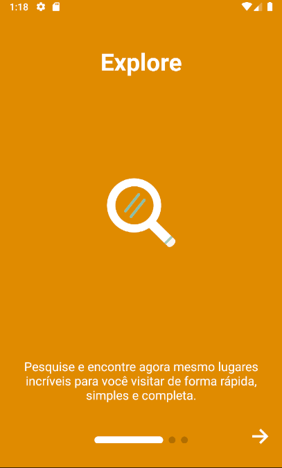
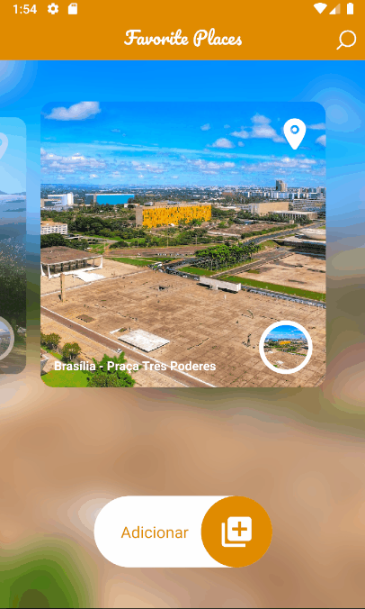

<h1 align="center">
  Favorite Places
</h1>

Lugares Incríveis

  
  
  

  

  
  
  
  
  
  

## 📅 Sobre

Favorite Places permite procurar e compartilhar lugares incríveis, inserir fotos, localização, ver vídeos, comentar e muito mais!

## 🌐 Tecnologias Usadas
Foram usadas essas tecnologias:

- [React Native](https://reactnative.dev/)
- [Yarn](https://yarnpkg.com/)
- [Async Storage](https://github.com/react-native-async-storage/async-storage)
- [Google-Signin](https://github.com/react-native-google-signin/google-signin)
- [React Navigation](https://reactnavigation.org/)
- [Axios](https://github.com/axios/axios)
- [Lottie](https://github.com/lottie-react-native/lottie-react-native)
- [App Intro Slider](https://github.com/Jacse/react-native-app-intro-slider)
- [React Native Elements](https://reactnativeelements.com/)
- [Image Crop Picker](https://github.com/ivpusic/react-native-image-crop-picker)
- [React Native Maps](https://github.com/react-native-maps/react-native-maps)
- [Snap-Carousel](https://github.com/meliorence/react-native-snap-carousel)
- [React Native Stars](https://www.npmjs.com/package/react-native-stars)
- [Vector Icons](https://github.com/oblador/react-native-vector-icons)
- [Youtube Iframe](https://www.npmjs.com/package/react-native-youtube-iframe)
- [Styled Components](https://styled-components.com/)
- [Typescript](https://www.typescriptlang.org/)

*Foram usados outros, mas esses são os principais.*

## ***</>*** Como usar o código?
1. Instale o **Yarn** em seu computador
1. Instale o **NodeJs** na versão >= 12.0
1. Clone este repositório `git clone https://github.com/jhonbergmann/favorite-places.git`

### ⚙️ Backend
1. Acesse a pasta *backend* e dê o comando `yarn install`
2. Acesse o arquivo *images_view.ts* dentro de *src/views/images_view.ts*
3. Na linha *7* altere a url para seu ip local -> exemplo: url: `http://SEU-IP-LOCAL:3333/uploads/${image.path}`
4. Acesse novamente a pasta *backend* e dê o comando `yarn dev`

### 📱 Mobile
1. Acesse a pasta *mobile* e dê o comando `yarn install`
2. Acesse o arquivo *api.js* dentro de *src/services/api.js*
3. Na linha *4* altere a baseURL para seu ip local -> exemplo: baseURL: `http://SEU-IP-LOCAL:3333`
4. Acesse novamente a pasta *mobile* e dê o comando `npx react-native run-android`
